# Onsen Robot Simulator v2 — Physics-True Browser Sim + ROS2 Control Stack

## Architecture decision

The current stack generates fake sensor data in Python and uses the FE only as a viewer. This inverts: the FE becomes the ground-truth world (game-style physics via Rapier WASM), and all sensors are *derived* from that world. ROS2 nodes become what they are on a real robot: firmware/controllers/perception. Headless AI work uses rosbag record/replay plus a synthetic fallback mode.

```mermaid
flowchart LR
  subgraph fe [Frontend Simulator browser, Vite + Three.js + Rapier]
    world[Physics world: onsen layout, movable objects with mass]
    vehicle[6-wheel raycast suspension chassis]
    arm[6-axis arm FK + gripper grab logic]
    rigs[Sensor rigs: LIDAR, front/back cameras, depth, sonar, IMU, contacts]
    ctrlUI[Controller UI: D-pad, arm panel, views]
  end
  rosbridgeNode[rosbridge ws 9090]
  subgraph ros [ROS2 containers]
    baseCtrl[base_controller: wheel firmware protocol]
    armCtrl[arm_controller: serial protocol firmware]
    arbiter[control_arbitrator]
    safety[robot_state_aggregator NEW: safety + state fusion]
    ai[onsen_ai_worker: detection + LLM planner]
    dummy[onsen_dummy_robot: replay / synthetic mode]
    bags[rosbag record / play]
  end
  fe <--> rosbridgeNode <--> ros
```

- FE publishes ground truth: `/scan`, `/camera/front/*`, `/camera/rear/*`, `/camera/depth/*`, `/sonar`, `/imu`, `/odom`, `/tf`, `/joint_states`, `/robot/contacts`, plus `/ground_truth/pose` and `/ground_truth/objects` (true object poses/classes for dataset labeling and drift/detection evaluation)
- FE subscribes to actuator targets: `/arm/joint_targets` (from arm firmware), `/base/wheel_targets` (from base firmware), `/safety/stop`
- Existing assets reused: [src/onsen_dummy_robot/onsen_dummy_robot/arm_protocol.py](src/onsen_dummy_robot/onsen_dummy_robot/arm_protocol.py) already implements your exact serial protocol (`Q`, `A <pose>`, `J`, `D`, `M`, `G`, `SPEED`, `STOP`, `CAL ...`, `RELAX/WAKE`); [base_controller_node.py](src/onsen_dummy_robot/onsen_dummy_robot/base_controller_node.py) (6-wheel skid steer) and [arm_controller_node.py](src/onsen_dummy_robot/onsen_dummy_robot/arm_controller_node.py) exist but were never registered in `setup.py`/compose — they get finished and wired in.
- Single source of truth for geometry: `shared/onsen_layout.json` (rooms, walls, fixtures, spawn points) consumed by both the FE world builder and the Python synthetic LIDAR/replay path (replaces the duplicated hardcoded room in `lidar_generator.py`; `layout.py` already anticipated this).

## Onsen environment (from the floor plan image)

Build the uploaded layout to scale (~14 x 12 m): central wooden corridor from ENTRANCE; left wing: make-up area (sinks/stools), resting area (loungers), shower stalls, large cold bath; right wing: locker room, sauna (stepped benches), small cold bath, shower stalls. Implementation:

- Static colliders: walls, partitions, bath rims (raised steps the robot must climb — this exercises the suspension), sauna benches, lockers, sink counters
- Movable dynamic bodies with realistic masses: towels (~0.3 kg, the pick targets, spawned scattered), buckets (~0.5 kg), stools (~2 kg), bottles (~0.2 kg), bath mats; robot pushing them obeys physics
- Two bins: main trash bin + towel gathering bin (drop zones with detection volumes that score a successful return)
- Visuals: procedural wood/tile/water materials, steam particle volume in bath/sauna zones (also degrades simulated LIDAR slightly — documented realism knob)

## Object interaction model

Every object carries a physics profile (`shared/object_profiles.json`: mass, friction, restitution, collider shape) so interactions emerge from the engine rather than scripted animations:

- **Robot <-> objects**: the chassis collider pushes dynamic bodies with momentum transfer — a 0.2 kg bottle skids away, a 2 kg stool resists and triggers a contact event; driving over a towel flattens it (low-profile collider, high friction, no damage to robot); hard impacts above an impulse threshold feed `/robot/contacts` -> safety e-stop
- **Gripper grasp**: gripper closing while a towel is inside the grasp volume creates a Rapier fixed joint (attach); `OPEN_GRIPPER`/`DROP_RELEASE` removes it; `PICK_SCOOP` works on flat towels because the gripper fingers slide under the low collider; grasp success depends on real geometry (approach angle, towel under a bench edge can fail) — failures are real, not random
- **Carried load**: an attached towel adds its mass to the kinematic chain; basket contents add mass to the chassis, visibly compressing the suspension and changing handling
- **Object <-> object**: stacking, toppling (bucket tips over and rolls), friction-dependent sliding on wet vs dry floor zones; bodies sleep when at rest for performance
- **Water zones**: bath volumes apply simple buoyancy + drag to objects thrown in (towels float, bottles bob); the robot entering water triggers a critical contact event -> e-stop
- **Bins**: sensor volumes detect which object body entered; correct bin (towel -> towel bin, trash -> trash bin) publishes a scored event on `/robot/events`
- **Scenario controls in UI**: "throw towel" button tosses a towel with a random impulse from a random direction (the core mission generator); drag-mode lets the user pick up and place/throw any movable object with the mouse to build test scenes; a reset button restores the layout's spawn state

## Custom object skins (upload -> detect -> interact)

A skin pipeline lets users re-texture objects at runtime and immediately test whether perception still finds them:

- **FE skin panel**: pick an object class (towel, bucket, mat, bottle) or an individual instance -> upload PNG/JPEG -> applied as the THREE texture on those materials; skins persist in `localStorage` and survive scene reset; a few bundled presets (white ryokan towel, striped, dark gray) ship as quick toggles
- **End-to-end effect**: the front/rear/depth cameras render the new skin, so `/camera/*` frames genuinely change — detection is challenged for real, not faked
- **Detection profile sync**: on upload the FE also POSTs the skin image to a new AI-worker endpoint `POST /profiles/<class>` which samples dominant HSV ranges from it and registers/updates that class's detection profile at runtime (`GET /profiles` to inspect, `DELETE` to revert to defaults) — so out of the box the robot re-acquires re-skinned towels, and a data scientist can instead disable auto-sync to study detection failure and tune profiles themselves (documented workflow in `docs/ai_worker_guide.md`, with a notebook that evaluates detection recall before/after a skin change)
- **Interaction unchanged**: skins are visual-only; physics profiles stay attached to the object class, so a re-skinned towel still grasps, floats, and scores like a towel

## Robot design — full specification (docs/robot_design.md; all dims in `shared/robot_spec.json` consumed by the FE builder, the Python synthetic mode, and the docs — one source of truth)

### Design constraints derived from the environment and existing firmware
- From [shared/onsen_layout.json](shared/onsen_layout.json): corridor 1.60 m wide, all doorways 1.10 m; traversable stairs are the resting-deck steps (risers 45 mm and 90 mm); bath rims are 280 mm high and must be NOT climbable (water = kill hazard); wet tile floors (low friction zones); LIDAR already pinned at h=0.62 m, 10 m range, 360 rays, 8 Hz
- From [base_controller_node.py](src/onsen_dummy_robot/onsen_dummy_robot/base_controller_node.py) (already coded, design must match): wheel radius 0.07 m (Ø140 mm), track width 0.47 m, max wheel speed 12 rad/s -> 0.84 m/s top speed
- From [arm_protocol.py](src/onsen_dummy_robot/onsen_dummy_robot/arm_protocol.py): 6 servos, 0-180 deg each, pulse 500-2500 us (bus-servo class); named poses fix the kinematic conventions (e.g. `PICK_SCOOP` = [90, 132, 68, 58, 90, 80] must touch the floor ahead; `DROP_BASKET` pan 178 deg places the basket at the arm's far-left limit)

### Chassis and drivetrain
- Footprint: chassis tub 0.62 L x 0.42 W x 0.14 H m, rounded ABS skirt; overall width incl. wheels 0.52 m; overall height to LIDAR top 0.67 m; mass budget 17 kg (frame 5.5, 6 hub motors 3.0, battery 2.5, electronics 1.0, sensors 0.7, arm 1.8, basket + payload 2.5)
- Clearance checks (documented in robot_design.md): doorway margin (1.10 - 0.52)/2 = 0.29 m per side; in-place spin diameter sqrt(0.68^2 + 0.52^2) = 0.86 m < 1.10 m doorway, so the robot can turn around inside any doorway
- 6 wheels Ø140 x 50 mm, soft rubber, high-grip tread (wet tile: sim friction mu = 0.45 wet / 0.8 dry per floor zone); axles at x = +0.24, 0, -0.24 m (wheelbase 0.48 m); each wheel is an independent trailing-arm + coil-over (Rapier vehicle controller wheel: suspension raycast)
- Suspension numbers (from the mass budget, not guessed): static load ~28 N/wheel; travel 60 mm with 15 mm static sag -> stiffness k = 1850 N/m; damping ratio 0.65 -> c = 94 N s/m; these are the actual Rapier `suspensionStiffness`/`damping` inputs
- Step capability: 45 mm riser = 0.64 x wheel radius — climbable for a 6x6 with independent springs and front-wheel spring assist (consistent with rocker/spring-assist literature reviewed); the 90 mm second step works because the front axle is already on the first step (stair phase-climbing). The 280 mm bath rim is 2x wheel diameter clearance — geometrically impossible to climb, which is the intended passive safety barrier, with the water-zone e-stop as backstop
- Approach/departure angle 34 deg (60 mm ground clearance, 90 mm overhang); battery mounted flat on the tub floor keeps CoG at z = 0.18 m -> static tip angles ~50 deg lateral and longitudinal; with arm at full forward reach + 0.3 kg towel the CoG shifts < 40 mm forward, still deep inside the support polygon (analysis included in robot_design.md)

### Rack architecture (heights are final; every placement justified by the visibility analysis below)
- Deck 0 (tub interior, z 0.06-0.20): battery (center-rear, counterweights the front-mounted arm), motor drivers, e-stop relay, cabling in side channels — fully enclosed, IP-skirted
- Deck 1 (z 0.34, open shelf on 4 corner standoffs): SBC compute, IMU at CoG (x 0.05, z 0.18 — physically below the shelf on a bracket), front sensor cluster on the leading edge, rear camera on the trailing edge; open sides leave the arm sweep and airflow clear
- Deck 2 (z 0.44): arm base front-center (x +0.26, on the chassis nose line so the pick workspace is ahead of the robot, not over it); collection basket 0.28 x 0.22 x 0.12 m at the arm's left-aft (bearing matches `DROP_BASKET` pan 178 deg), rim at z 0.56; LIDAR mast Ø30 mm rear-center (x -0.22) rising to the scan plane
- Nothing on any deck except the mast and stowed arm exceeds z 0.58, keeping a 40 mm guard band under the 0.62 m scan plane

### Sensor suite (each modeled after real hardware so simulated data has real-world statistics)
- 360 deg LIDAR, RPLIDAR A1-class: optical center z 0.62 on the rear-center mast; 0.15-10 m, 360 x 1 deg, 8 Hz, accuracy ~1% of range (the sim noise sigma) — matches the values already in the layout file; mast is at the rotation center so it casts no shadow
- Front RGB camera: z 0.38 on deck-1 leading edge, pitch -15 deg, HFOV 70 deg, 640x480 — frames the floor from 0.4 m to the horizon for towel detection
- Rear RGB camera: z 0.38 trailing edge, pitch -10 deg, HFOV 70 deg — reversing and rear coverage
- Depth camera, D435-class: z 0.36 front face, pitch -20 deg, FOV 87x58 deg, range 0.28-3 m, 320x240 @ 5 Hz — vertical FOV spans -49 to +9 deg, so it sees the floor from 0.31 m ahead AND low obstacles (bath rims, bins, stools) out to 3 m
- Sonar x3, HC-SR04-class: z 0.10 on the nose at bearings 0 and +/-25 deg, 15 deg cones, 0.02-4 m — the low-altitude safety net and the steam-immune ranging channel
- Contact skirt: bumper strips at z 0.08 on all four sides (front, rear, left, right collider segments) -> named `part` in `/robot/contacts`
- Wheel encoders (6x) and arm joint feedback come from the actuator sims themselves

### Visibility and occlusion analysis (the core of robot_design.md)
- The LIDAR plane at 0.62 m sees: all walls (2.6 m), shower partitions (1.4 m), lockers (1.9 m), make-up counter (0.85 m), upper sauna bench (0.85 m) -> reliable for mapping/localization
- The LIDAR plane does NOT see (verified against every fixture height in the layout): bath rims 0.28, loungers 0.41, lower sauna bench 0.45, rest table 0.45, both bins 0.55, stools/buckets/towels < 0.30 — hence the two-tier perception design: high LIDAR for SLAM-grade geometry, depth camera + sonar for the low-obstacle layer. This split is the single most important design decision and is documented with a per-fixture visibility list
- Near-field pick blind zone: the depth camera's floor coverage starts 0.31 m ahead, but the gripper picks at 0.15-0.50 m — the final 20 cm of an approach is done on target memory (measure during approach, dead-reckon the last segment), which is standard practice on real pick robots and is documented as the expected controller behavior for AI engineers
- Side blind zone below 0.34 m: no ranging sensor covers the flanks at low height; mitigated by the contact skirt, the arbitrator's speed cap during rotation, and documented as a known limitation (matches real budget service robots)
- Arm-in-scan-plane: stow and search poses stay under z 0.58 (guard band); only `DROP_BASKET`/`DROP_RELEASE` swing the wrist above 0.62 for ~1 s in the 160-180 deg sector — the safety aggregator self-filters that sector while `/arm/state` reports a DROP phase, identical to real-robot self-filtering
- Camera cross-coverage: front RGB and depth share the forward view (redundancy for detection vs ranging); rear RGB closes the reversing blind spot; no robot part enters any camera frustum at any joint configuration (arm sweeps 0-180 deg pan above and ahead of the front sensor cluster, never in front of the lenses at search/pick heights)

### Arm — kinematic spec matched to the firmware poses
- Mount: base plate on deck 2 at z 0.44; shoulder pivot z 0.50; joint order = firmware J0-J5: J0 base pan (0 = full right, 90 = forward, 180 = full left), J1 shoulder pitch, J2 elbow, J3 wrist pitch, J4 wrist roll, J5 gripper (servo angle -> finger opening 0-90 mm, parallel 2-finger with silicone pads)
- Link lengths: upper arm 0.25 m, forearm 0.25 m, wrist-to-fingertip 0.20 m -> 0.70 m max reach; floor pick at 0.45 m beyond the nose needs sqrt(0.48^2 + 0.50^2) = 0.69 m — reachable with margin across the whole 0.10-0.45 m pick window; basket drop at pan 178 needs only 0.30 m horizontal — trivially inside the envelope
- FK validation as a unit test: every named pose in `ACTIONS` is run through the FE's FK chain and asserted (PICK_SCOOP fingertip z within 15 mm of the floor, DROP_BASKET fingertip above the basket opening, STOW envelope below z 0.58) — the firmware pose table and the 3D model can never drift apart
- Servo dynamics for realism: max joint speed 200 deg/s at SPEED 100, first-order lag tau 80 ms — produces the measured-vs-target tracking error visible in `/joint_states`
- Payload: 0.3 kg towel at full reach = ~2.1 N m at the shoulder, within bus-servo class torque (~25 kg cm geared) — stated in the doc so the sim's lift behavior is justified

### Industrial design (cosmetics with function)
- Two-tone service-robot language (warm white shrouds + charcoal skirt) matching onsen interiors; rounded shrouds over arm links (no pinch points, wipe-clean for humid rooms); recessed sensor windows with hoods to suggest anti-fog/anti-splash; amber LED status ring at the skirt (state-colored: idle/moving/picking/e-stop) which also gives the cameras a visible robot-state cue in recordings; carry handle and labeled e-stop button on the rear deck — all modeled as meshes in the FE

## Sensor simulation methodology (ground truth -> realistic streams)

Every sensor is computed from the physics/render world, then degraded through a noise model before publishing — never synthesized from nothing. All messages get sim-clock timestamps and proper `frame_id` + TF; a sensor scheduler staggers heavy sensors (LIDAR, cameras) across frames so no render tick double-pays.

### LIDAR — `sensor_msgs/LaserScan`, 360 beams, 10 Hz, `lidar_link`
- One Rapier `castRay` per beam from the mast origin, rotating sweep emulated by batching beams across physics ticks (36 beams/tick at 100 Hz physics = one full revolution per 100 ms, giving a real `time_increment` like a spinning head)
- Hit distance -> range; then: Gaussian range noise (sigma 1.5 cm), ~0.5% random dropout, max range 12 m -> `+Inf`
- Material-aware returns: water surfaces (baths) and mirrors (make-up area) are specular -> probabilistic no-return; beams crossing steam volumes get extra dropout + range jitter (scaled by `REALISM_PROFILE`)
- Beams that hit the robot's own arm during pick cycles return real self-hits (the safety node self-filters that sector — same as a real robot)

### RGB cameras (front + rear) — `CompressedImage` + `CameraInfo`, 640x480, ~5 Hz each
- Each mount is a dedicated `THREE.PerspectiveCamera` (front tilted down 15 deg, rear level) rendered to an offscreen `WebGLRenderTarget`, staggered so front/rear never render in the same frame
- Readback -> canvas -> JPEG (quality from `REALISM_PROFILE`); intrinsics in `CameraInfo` derived from the actual projection (fx = w / (2 tan(hfov/2))), so detection geometry is consistent with the image
- Realism: warm color grade + contrast loss inside steam zones, slight vignetting, optional per-frame drop probability — what a cheap module in a humid room actually does

### Depth camera (front, RGB-D) — `Image` 16UC1 (mm) + `CameraInfo`, 320x240, ~5 Hz
- Reads the WebGL depth buffer of the front camera pass, linearized via near/far planes -> metric depth, quantized to millimeters (RealSense-style)
- Noise grows quadratically with distance (sigma ~ 0.001 * z^2, stereo-disparity model); invalid (0) pixels at grazing angles and on specular water; this is the sensor the AI worker uses for pick ranging

### Sonar x3 (front, low) — `sensor_msgs/Range` per transducer, 15 Hz
- Each transducer casts a fan of ~7 rays inside a 15 deg half-angle cone and reports the minimum hit (real ultrasonic beam-width behavior: wide objects read closer)
- Range 0.02-4.0 m, Gaussian noise, occasional ghost echo; deliberately NOT affected by steam — the documented reason sonar is on the robot at all

### IMU — `sensor_msgs/Imu`, 50 Hz, at center of mass
- Angular velocity read directly from the chassis rigid body; linear acceleration from delta-v/dt plus gravity projected into the body frame — suspension oscillation and step impacts show up for free
- White noise + slow bias random-walk on both gyro and accel (configurable per `REALISM_PROFILE`)

### Wheel encoders + odometry — `/odom` + TF, 20 Hz
- Per-wheel rotation integrated from the vehicle controller's actual wheel angular velocities (encoder ticks), then fused with skid-steer kinematics — NOT the ground-truth pose
- Skid-steer turning slips by construction, so odom drifts realistically over time; ground truth is published separately on `/ground_truth/pose` so data scientists can quantify drift

### Joint states — `sensor_msgs/JointState`, 20 Hz
- Arm servos simulate first-order lag + velocity limit toward firmware targets; `/joint_states` reports the *measured* (lagging) position, so tracking error during motion is observable, matching the firmware's `STATE` query semantics

### Contacts / bumper — `/robot/contacts` JSON, event-driven
- Rapier collision events on chassis/arm colliders -> `{part, impulse, normal, object_id, object_class}`; feeds the safety aggregator's immediate e-stop

The headless `synthetic` mode reuses the same noise-model parameters (shared constants in `shared/`) so Python-generated and FE-generated data are statistically consistent.

## Workstreams

### 1. Frontend rewrite ([frontend/](frontend/))
Vite + modular vanilla JS, multi-stage Docker build (node build -> nginx). Modules: `physics/` (world, fixed-timestep loop, vehicle), `env/` (layout loader, movable objects, steam), `robot/` (chassis, arm, gripper, sensor mounts), `sensors/` (lidar raycaster, offscreen render-target cameras front/rear/depth, sonar cones, imu, odom, contact reporter), `ros/` (roslib topic registry, publish throttling: cameras ~5 Hz JPEG, LIDAR 10 Hz x 360 rays, odom 20 Hz), `ui/` (HUD, D-pad/WASD, browser Gamepad API support for physical controllers, arm command console speaking the serial protocol, ORBIT/FOLLOW/FPS views, minimap). Keyboard/manual control always available.

### 2. Base + arm control path ([src/onsen_dummy_robot/](src/onsen_dummy_robot/))
- Register and finish `arm_controller_node` (`/arm/command` text in, `/arm/response`, `/arm/joint_targets` out) — verify every command in your sample transcript passes
- Finish `base_controller_node` with an equivalent flexible text protocol (`Q`, `V <l> <r>`, `W <id> <vel>`, `SPEED`, `STOP`) consuming arbitrated `/cmd_vel` and emitting `/base/wheel_targets`
- Keep `control_arbitrator_node` (manual `/cmd_vel/ui` vs auto `/cmd_vel/auto`)

### 3. NEW robotics-engineer worker: `onsen_robot_state` package
`robot_state_aggregator_node`: fuses `/robot/contacts`, `/scan`, `/odom`, `/arm/state`, `/imu` -> immediate `/safety/stop` on collision/tilt (base+arm firmware latch until `RESET`), publishes aggregated `/robot/state` JSON (pose, velocity, arm phase, battery, safety flags) for the AI worker's decisions.

### 4. AI worker for data scientists ([src/onsen_ai_worker/](src/onsen_ai_worker/))
- Split monolith into `detection.py` (HSV now, ONNX-swappable), `planner.py`, `llm_client.py` (OpenAI-compatible via `LLM_BASE_URL`/`LLM_API_KEY`/`LLM_MODEL`, deterministic mock when unset so compose runs keyless), keep `/detected_objects` + `/task_plan` schemas and the :5000 upload API
- NEW `mission_executor_node` — closes the autonomy loop the original goal requires ("AI decisions control robots autonomously"): subscribes `/task_plan`, `/detected_objects`, `/robot/state`; drives the robot via `/cmd_vel/auto` (through the arbitrator in AUTO mode) and the arm via `/arm/command` protocol sequences; executes the full mission state machine: patrol -> approach towel -> pick sequence (`PRE_PICK` ... `PICK_RETRACT`) -> navigate to bin -> `DROP_BASKET`/`DROP_RELEASE` -> resume patrol; aborts safely on `/safety/stop`
- `notebooks/` for the data-scientist workflow: live-topic quickstart, bag analysis, detection eval against `/ground_truth/objects`, and the flagship example from the brief — *feed arm state + detections to an LLM and command the arm until it reaches the towel* — runnable against `SIM_SOURCE=replay` with no FE open

### 5. Headless mode ([onsen_dummy_robot](src/onsen_dummy_robot/))
`SIM_SOURCE=fe|synthetic|replay`: `fe` mutes Python generators (FE is truth); `synthetic` keeps improved generators raycasting the shared layout JSON; `replay` loops recorded bags — so an AI engineer can iterate on e.g. arm-to-towel control against realistic recorded streams without the FE.

### 6. Compose, E2E, tests, docs
- [docker-compose.yml](docker-compose.yml): add `base_controller`, `arm_controller`, `robot_state`, keep DDS invariants (`FASTDDS_BUILTIN_TRANSPORTS: UDPv4`, no events executor); `e2e` profile runs a Playwright container: loads FE, asserts rosbridge connectivity, drives base, runs an arm pick command transcript, verifies topic flow
- pytest: `arm_protocol` transcript tests, base protocol, aggregator safety latching, planner/LLM mock
- Docs: rewrite [README.md](README.md) (quick start, controls, services); `docs/architecture.md`, `docs/topics.md` (full contract), `docs/robot_design.md` (design rationale incl. suspension/sensor placement trade-offs), `docs/ai_worker_guide.md` (data-scientist workflow: topics, bags, upload API, LLM config), `docs/robotics_worker_guide.md`; refresh `docs/ai_knowledge.md`
- Final verification: full stack `docker compose up`, then hands-on browser session (drive through onsen, pick a towel, drop in bin, safety stop on collision) plus the Playwright suite

## Engineering standards

### Coding rules (applied, not aspirational)
- **KISS**: no framework on the FE (vanilla JS modules + Vite only); no ROS actions/services where a topic suffices; cloth sim, soft bodies, and nav stacks deliberately out of scope — towels are rigid low-profile bodies and that trade-off is documented
- **DRY**: one geometry source (`shared/onsen_layout.json`), one physics-profile source (`shared/object_profiles.json`), one noise-parameter source shared by FE and Python synthetic mode; topic names/schemas defined once per side (FE `ros/topics.js` registry, Python `topics.py` constants) — never string-literals scattered through nodes
- **SOLID**: each ROS node has exactly one job (firmware emulation, arbitration, state fusion, perception); each FE sensor is a class with the same minimal interface (`update(dt)`, `publish()`) so adding a sensor never touches the world loop; detection/planner/LLM behind small interfaces so HSV -> ONNX or mock -> real LLM swaps without touching the node; noise models injected, not hardcoded
- No obvious comments; comments only for non-obvious physics/trade-off rationale (e.g. why beams batch across ticks). Type hints on all Python; docstrings only where behavior isn't evident from signatures
- Small, focused modules — nothing like the current 1,076-line `app.js` or 732-line `scene_generator.py` survives the rewrite

### Quality gates
- Python: `ruff` + `mypy` (aligning with the repo's existing quality-check rule), `pytest` in the ROS image
- JS: ESLint + Prettier, `vitest` for pure logic (arm FK, skid-steer kinematics, noise models, protocol parsing)
- Tests use realistic data, never stub internal classes: protocol tests replay your full sample transcript verbatim and assert each response line; safety tests feed real recorded contact payloads; planner tests run on real detection JSON fixtures
- CI-equivalent locally: a `make check` (lint + types + unit) target documented in README; Playwright E2E as the integration gate

## Testing plan

### Level 1 — Python unit tests (pytest, run inside the ROS image; realistic data, no internal stubbing)
- `arm_protocol`: replay the full sample transcript from the brief verbatim (every `Q`/`A`/`J`/`D`/`M`/`G`/`SPEED`/`STOP`/`CAL`/`RELAX`/`WAKE` line) and assert each response, including the error paths (`ERR LIMIT joint=0 value=295`, `ERR STOPPED` until `A RESET_ERROR`); calibration persistence round-trip (`CAL SET/SAVE/LOAD/RESET`)
- `base_controller` protocol: `V/T/W/Q/SPEED/STOP/RESET_ERROR` replies, twist -> per-wheel kinematics math, wheel-mode vs twist-mode timeout zeroing, safety latch ignores `RESET_ERROR` while `/safety/stop` is asserted
- `robot_state_aggregator`: feed recorded contact JSON payloads -> e-stop latched within one tick; tilt threshold from IMU fixtures; arm-sector scan self-filter active exactly while arm state is in a DROP phase; `/robot/state` schema stability
- `planner` + `mission_executor`: real `/detected_objects` JSON fixtures (recorded from the sim) -> expected task plans; mission state machine transitions including abort-on-safety mid-pick; `llm_client` mock determinism and OpenAI-payload shape
- `detection` + skin profiles: detection on saved sim frames; `POST /profiles/<class>` HSV resampling changes detection output for a re-skinned fixture frame

### Level 2 — FE unit tests (vitest, pure logic only, no WebGL needed)
- Arm FK: every pose in the firmware `ACTIONS` table -> fingertip position asserted (PICK_SCOOP touches floor within 15 mm, DROP_BASKET clears the basket rim, STOW stays under z 0.58)
- Skid-steer odometry math: encoder integration vs analytic arcs; drift appears under injected slip
- Noise models: seeded RNG reproducibility, LIDAR noise sigma matches spec, depth sigma grows as z^2
- Protocol/JSON codecs: topic message builders against recorded rosbridge payloads
- Layout/spec loaders: `onsen_layout.json`, `robot_spec.json`, `object_profiles.json` validated against schemas (a broken layout fails tests, not runtime)

### Level 3 — Integration (docker compose, no browser)
- Topic-contract smoke test (extends the existing quality-check rule): every topic in `docs/topics.md` exists with the right type and a publisher; expected publish rates within tolerance
- Control path: publish a protocol line to `/arm/command` -> assert `/arm/response` and `/arm/joint_targets`; `/cmd_vel/ui` in MANUAL -> `/base/wheel_targets` non-zero; `/safety/stop` true -> targets zero regardless of input
- Replay path: play a checked-in sample bag -> AI worker emits detections and plans; mission executor produces `/cmd_vel/auto`

### Level 4 — Browser E2E (Playwright container in compose, `e2e` profile)
Scenario suite run against the real stack:
1. Boot: FE loads, rosbridge connects, sim heartbeat on `/sim/status`, all HUD panels populate
2. Manual drive: switch MANUAL, drive forward 2 s -> `/odom` x advances, wheels spin, suspension visibly settles
3. Stair traversal: drive onto the resting deck (45 + 90 mm steps) -> chassis climbs, IMU shows the impacts, no e-stop
4. Towel mission (the core acceptance test): throw a towel via UI, switch AUTO -> robot approaches, runs the pick sequence, towel attaches, drives to towel bin, drops, scored event on `/robot/events`
5. Arm console: paste the brief's command transcript into the FE console -> responses match the firmware test expectations end-to-end through ROS
6. Safety: drive into a stool above threshold speed -> `/robot/contacts` fires, `/safety/stop` latches, wheels zero, UI shows E-STOP, `RESET_ERROR` + safety clear recovers
7. Sensors: LIDAR minimap shows walls; front/rear/depth camera topics deliver frames at expected rates; bath rim invisible to `/scan` but present in depth frames (validates the two-tier perception claim)
8. Skin upload: upload a towel skin -> PiP camera shows it, detection re-acquires after profile sync
9. Water hazard: push a towel into the bath -> it floats; force-drive toward the rim -> robot cannot climb it

### Level 5 — Performance and manual QA
- Playwright captures FE frame rate (must hold ~60 fps with physics + 3 render passes on the reference machine) and rosbridge message rates against the budget table
- Manual QA checklist in README (updated version of the existing one): docker compose up, single-tab rule, per-topic echo commands, Foxglove panels

### Known concerns and mitigations
- **rosbridge bandwidth**: 2x JPEG 640x480 @ 5 Hz (~60-120 KB/s) + depth 320x240 @ 5 Hz + LIDAR 10 Hz is fine over localhost WebSocket, but budgets are enforced in one throttle config; depth published as PNG-compressed 16UC1 to stay compact
- **GC pressure in the sim loop**: preallocated typed arrays for scan ranges, reused render targets and JPEG canvases, no per-frame allocations in the physics tick — required for stable 60 fps with physics + 3 render passes
- **Background tab throttling**: browsers throttle rAF when the tab is hidden — the sim clock uses a clamped fixed-timestep accumulator and publishes a `/sim/status` heartbeat so ROS-side consumers can detect a paused world; documented single-active-tab rule (also prevents double publishers)
- **DDS invariants**: the existing do-not-change list holds (`FASTDDS_BUILTIN_TRANSPORTS: UDPv4`, no `use_events_executor` on rosbridge, FE never publishes `/cmd_vel` directly)
- **Depth readback stalls**: WebGL `readPixels` is synchronous; depth/camera readbacks are staggered and capped at 5 Hz so the render loop never blocks more than one readback per frame
- **Determinism**: fixed physics timestep + seeded RNG for noise models so recorded runs are reproducible enough for replay-based debugging

## Suggested delivery order
Phases 1-2 first (world + robot driving + control path), then sensors, then safety/AI/headless, then E2E + docs. Each phase leaves the stack runnable with `docker compose up`.